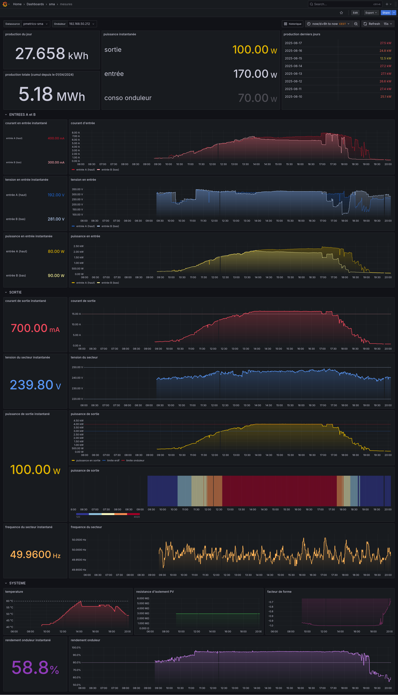
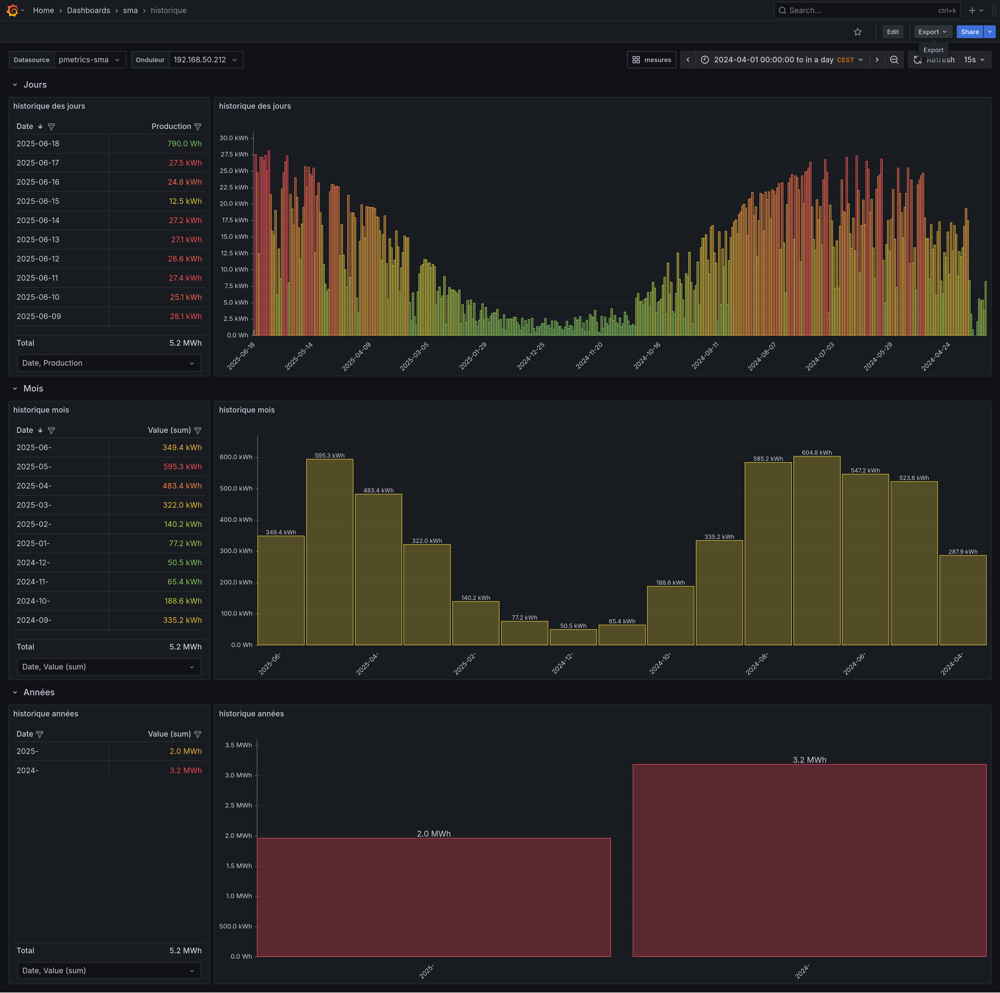
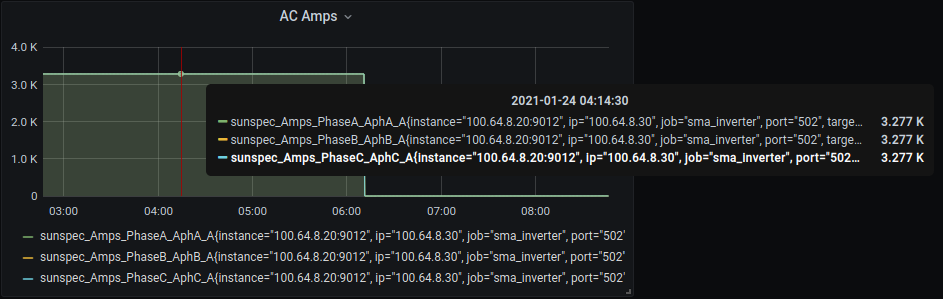

# Prometheus Sunspec Exporter

- It's forked from https://github.com/inosion/prometheus-sunspec-exporter
- May have some re-coding to do around what consitutes a gauge, counter etc
- is optimised to read only the "sunspec" model you desire (reduce call load on the device)
- Need to run one exporter "per" modbus sunspec address/ip/port (current limitation)
- Uses https://github.com/sunspec/pysunspec


# Sunspec Devices

  Sunspec is alliance of 100 Solar and Electricity Storage products, that provides a standard Modbu API.

  With this API, a prometheus exporter was born, in approximately 8 hours.

  Devices supported can be found here (Sunspec Modbus Certified List)[https://sunspec.org/sunspec-modbus-certified-products/]
  Manufacturers supporting Sunspec:
  - Fronius
  - SMA
  - Huawei
  - ABB
  - Sungrow

  See (tested-devices)[docs/tested-devices.md] for more information.


# Working mode

**start** : is the normal working mode, it provide openmetrics endpoint and is made to work as a service.

**query** : is a special mode, it send to the stdout a XML content to find out what data you want ; This mode is necessary at the beggining only.


# Running the exporter

## Step 1: Generate the config file

It's an important file, a sample is in [docs/sample_config.yml](docs/sample_config.yml).

```yaml
---
log_level: INFO  # "INFO", "WARNING", "ERROR", "CRITICAL"
log_metrics: true

mode: start   ## "start" or "query"
port: 9807

sunspec_ip: 192.168.50.212
sunspec_port: 502
modbus_timeout: 1  # timeout in seconds

sunspec_address: 126
sunspec_model_ids:
  - "101"
  - "122"
  - "160"

filters:
  - "Amps_Phase[ABC]_Aph[ABC]_A gt:3276 0.0"
```

You'll have to run the exporter in **query mode** and to analyse the XML to the nice text, and look at the values printed, work out which "model_id" you are after, 
which section, and then that becomes your set of model_id's.

An example of XML output you'll get in [docs/sample_output_query.xml](docs/sample_output_query.xml).

NOTE: See **Filetring** section bellow to understand.


**You'll have to try each mode_id in start mode, because they can not work...**


## Step 2: Run directly (in virtualenv)

```bash
python3 pip install -r ./requirements.txt
python3 ./sunspec_exporter/sunspec_exporter.py --config=./docs/sample_config.yml
```

## Step 2: Run With docker

```bash
## build
docker build -t sunspec-exporter:v1.0.0 .

## run
docker run \
  --volume="${PWD}/docs/sample_config.yml:/sunspec_exporter.yml"
  --entrypoint="/sunspec_exporter/sunspec_exporter.py --config=/sunspec_exporter.yml" \
  sunspec-exporter:v1.0.0
```

## Step 3: Integrate openmetrics collector

In your prometheus or victoriametrics-vmagent (recommanded), add a job to get this export metrics endpoint like :

```yaml
scrape_configs:
  - job_name: sunspec-exporter
    scrape_interval: 15s
    static_configs:
      - targets:
          - sunspec-exporter_dev:9807
```

An example of openmetrics returned is in [docs/sample_output_metrics.log](docs/sample_output_metrics.log).
And an of stdout logs displayed during a measurment [docs/sample_output_measure.log](docs/sample_output_measure.log).


# Grafana dashboard 

## measues view

JSON code is in [grafana/mesures.json](grafana/mesures.json).




## historical view

JSON code is in [grafana/historique.json](grafana/historique.json).




# Filtering

Some devices needs some tweaking, on the values they return.
Some SMA Solar inverters return 3276.8 for NaN. 
At night time, the DC Amps returns that value. Which is non too helpful in Grafana



To correct this, we can remap each returned value, before prometheus collects it. 

```
# Example of METRICFILTER
--filter "Amps_Phase[ABC]_Aph[ABC]_A gt:3276 0.0"
```
METRICFILTER is a space separated 3-Tuple, <metric_regex> <function>:<args> <replace_value> 

"Amps_Phase[ABC]_Aph[ABC]_A gt:3276 0.0"

Which reads, when the metric matching regex, Amps_Phase[ABC]_Aph[ABC]_A is greater than 3276, set the metric as 0.
In this example case, the inverter jumps from low 0.4, 0.5 Amps, up to 3276.7 (signed int16 Upper) represented as NaN. 

This filter config removes that problem.
